# <h1 align="center">Laporan Praktikum Modul Dasar-Dasar Python untuk Sains Data</h1>
<p align="center">Zahra Adya Nindita</p>

## Dasar Teori

Python  adalah  bahasa  pemrograman  yang  menggunakan  interpreter untuk     menjalankan     kode     programnya. ythonmengadopsi paradigma  pemrograman  dari  beberapa  bahasa  lain,  termasuk  paradigma pemrograman  prosedural  seperti  bahasa  C,  pemrograman  berorientasi  objek seperti  Java,  dan  bahasa  fungsional  seperti  Lisp.  Kombinasi  paradigma  ini memudahkan  para  programmer  dalam  mengembangkan  berbagai  proyek menggunakan Python.

Tipe data pada bahasa Pemrograman Python di antaranya berupa integer, float, boolean, dan complex. Berikut adalah beberapa tipe data yang tersedia di Python [11][12][13]:

a. Integer (int): tipe data yang merepresentasikan bilangan bulat. Contoh: 1, 2, 3, 4, 5, -1, -2, -3, dan sebagainya.

b. Float: tipe data yang merepresentasikan bilangan desimal. Contoh: 1.0, 2.5, 3.1415, -0.5, dan sebagainya.

c. Boolean (bool): tipe data yang merepresentasikan nilai benar atau salah (True atau False). Contoh: True, False.

d. Complex: tipe data yang merepresentasikan bilangan yang terdiri dari bagian real dan imajiner. Dalam Python, bilangan kompleks ditulis dalam format "a+bj", di mana "a" adalah bagian real, "b" adalah bagian imajiner, dan "j" adalah simbol imajiner.
## Guided

### 1. Buat program yang menampilkan nama dan umur
```python
nama = "Yanto"
umur = 38
print(f"Nama : {nama} \nUmur : {umur}")
```
### 2. Buat variabel untuk menyimpan nilai luas dan keliling lingkaran, hitung hasilnya.
```python
from math import pi

jari = 8
luas = pi *jari**2
keliling = 2*pi*jari
print(f"Luas Lingkaran : {luas} \nKeliling Lingkaran : {keliling}")
```
### 3. Tampilkan tipe data dari variabel yang menyimpan angka dan teks.
```python
angka = 129
teks = 'ini angka'
print(f"Tipe Data Angka : {type(angka)} \nTipe Data Teks : {type(teks)}")
```
### 4. Buat program yang mengubah nilai dari tipe integer menjadi float.
```python
nilai = 100
print(f'nilai kamu adalah {nilai} dan tipe datanya adalah {type(nilai)}')
nilai = float(nilai)
print(f'nilai kamu adalah {nilai} dan tipe datanya adalah {type(nilai)}')
```
### 5. Buat program yang mengubah string menjadi integer dan sebaliknya.
```python
a = "123"
print(f"Tipe Data a : {type(a)}")
a = int(a)
print(f"Tipe Data a : {type(a)}")
```
### 6. Buat program yang mengalikan string dengan angka
```python
text = "ulang "
multiplied_text = text * 3
print(multiplied_text)
```
### 7. Buat program yang memeriksa apakah angka adalah bilangan genap atau ganjil
```python
number = 7
if number % 2 == 0:
  print("Genap")
else:
  print("Ganjil")
```
### 8. Buat program yang memeriksa apakah sebuah nilai lebih besar dari 100
```python
value = 150
if value > 100:
    print("lebih dari 100")
else:
    print("100 atau kurang dari")
```
### 9. Buat program yang menerima input umur dan menampilkan kategori umur (anak-anak, remaja, dewasa)
```python
age = 16
if age <= 12:
    print("Anak-anak")
elif 13 <= age <= 17:
    print("Remaja")
else:
    print("Dewasa")
 ```
 ### 10. Buat program yang meminta input nama pengguna, jika nama benar tampilkan "Selamat datang"
 ```python
 username = input("Enter username: ")
if username == "Jono":
    print("Selamat datang {username}")
elif username == "Slamet":
    print(f"Selamat datang {username}")
else:
    print("Nama tidak dikenali")
```
### 11. Buat program yang menampilkan apakah suatu tahun adalah tahun kabisat
```python
year = 2024
if (year % 4 == 0 and year % 100 != 0) or (year % 400 == 0):
    print("Tahun Kabisat")
else:
    print("Bukan Tahun Kabisat")
 ```
 ### 12. Buat program untuk menentukan apakah seseorang boleh memberikan suara berdasarkan umurnya
 ```python
 age = 18
if age >= 18:
    print("Boleh memberikan suara")
else:
    print("Tidak boleh memberikan suara")
```
### 13. Buat program yang meminta input tiga angka dan menampilkan angka terbesar.
```python
a, b, c = 3, 7, 5
largest = max(a, b, c)
print(f"Nilai terbesar {largest}")
```
### 14. Buat program yang mengecek apakah dua string memiliki panjang yang sama
```python
str1 = "hello"
str2 = "world"
if len(str1) == len(str2):
    print("Memiliki Panjang yg sama")
else:
    print("Memiliki panjang yg berbeda")
```
### 15. Buat program yang menampilkan angka 1 sampai 10 menggunakan for loop
```python
for i in range(1, 11):
    print(i)
```
### 16. Buat program yang menampilkan bilangan genap dari 2 sampai 20 menggunakan while loop
```python
i = 2
while i <= 20:
    print(i)
    i += 2
```
### 17. Buat program yang menerima input dan menampilkan kalimat tersebut sebanyak 5 kali
```python
sentence = input("Masukkan Kalimat: ")
for _ in range(5):
    print(sentence)
```
### 18. Buat program yang membaca isi dari file teks.
```python
with open("example.txt", "r") as file:
    content = file.read()
    print(content)
```
### 19. Buat program yang menghitung jumlah kata dalam sebuah file.
```python
with open("example.txt", "r") as file:
    content = file.read()
    word_count = len(content.split())
    print(word_count)
```
### 20. Buat method dalam class untuk menampilkan informasi mahasiswa.
```python 
class Mahasiswa:
    def __init__(self, nama, umur, jenis_kelamin):
        self.nama = nama
        self.u = umur
        self.jk = jenis_kelamin

    def tampilkan_informasi(self):
        print(f"Nama: {self.nama}, Umur: {self.u}, Jenis Kelamin : {self.jk}")
```

## Unguided 

### 1. [Buatlah program yang dapat menghasilkan pola berbentuk angka seperti di bawah ini, dengan syarat angka yang ditampilkan adalah hasil dari penjumlahan bilangan prima sebelumnya:
 1 
2 3
5 7 11
13 17 19 23]

```python

def bilprima(n):
   # cek apakah n bilangan prima.
    if n < 2:
        return False
    for i in range(2, int(n**0.5) + 1):
        if n % i == 0:
            return False
    return True

def prima(hitung):
    # daftar bil prima
    prima = []
    num = 2
    while len(prima) < hitung:
        if bilprima(num):
            prima.append(num)
        num += 1
    return prima

def pola(baris):
    # pola angka
    total_angka = (baris * (baris + 1)) // 2  # angka yang dibutuhkan
    angkaprima = prima(total_angka - 1)  # -1 karena kita mulai dengan 1
    angka = [1] + angkaprima # tamabah 1 diawal

    index = 0
    for i in range(1, baris + 1):
        no_baris = angka[index:index + i]
        print(' '.join(map(str, no_baris)))
        index += i

if __name__ == "__main__":
    barisyangdiinginkan= 4  # jumlah baris
    pola(barisyangdiinginkan)

```
#### Output:
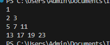

Kode di atas digunakan untuk mencetak pola angka yang dimulai dari angka 1 dan diikuti oleh deret bilangan prima, disusun dalam bentuk segitiga yang jumlah barisnya disesuaikan dengan input user.

### 2. [Buatlah sebuah fungsi yang menerima dua input berupa list angka. Fungsi ini harus mengembalikan sebuah list baru yang berisi elemen dari dua list input yang memiliki indeks ganjil. List baru tersebut juga harus diurutkan secara menurun berdasarkan nilai elemen]

```python

def urutganjil(list1, list2):
    # ambil elemen dari masing2 list
    listangka= list1[1::2] + list2[1::2]
    # mengurutkan angka
    listangka.sort(reverse=True)
    return listangka

# meminta input 
def inputlist(prompt):
    return list(map(int, input(prompt).split()))

# main 
def main():
    print("Masukkan angka untuk list ke-1, dipisahkan dengan spasi:")
    list1 = inputlist("List 1: ")
    
    print("Masukkan angka untuk list ke-2, dipisahkan dengan spasi:")
    list2 = inputlist("List 2: ")
    
    hasil = urutganjil(list1, list2)
    print("urutan elemen dengan indeks ganjil secara menurun:")
    print(hasil)

if __name__ == "__main__":
    main()

```
#### Output:
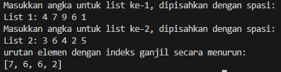

Kode di atas digunakan untuk  mengambil elemen-elemen ganjil dari dua list, menggabungkannya, dan mengurutkan hasilnya secara menurun.

### 3. [Buat sebuah program untuk mensimulasikan transaksi ATM. Program harus: 1. Meminta pengguna memasukkan PIN (dibatasi 3 kali percobaan). 2. Setelah PIN benar, meminta jumlah penarikan. 3. Jika saldo kurang dari jumlah yang ditarik, munculkan pesan kesalahan. 4. Jika penarikan berhasil, tampilkan saldo akhir.]

```python

pin = "3328"  
saldo = 500000      
maks_percobaan = 3      
percobaan = 0         

# masukkan PIN
while percobaan < maks_percobaan:
    pin = input("Masukkan PIN: ")
    if pin == pin:
        print("PIN benar! silakan lanjutkan.")
        break
    else:
        percobaan += 1
        print(f"PIN salah! anda memiliki {maks_percobaan - percobaan} percobaan tersisa.")
        
if percobaan == maks_percobaan:
    print("habis batas percobaan PIN. Akun terkunci.")
else:
    # uang yang ingin ditarik
    try:
        jumlah_tarik = float(input("Masukkan jumlah yang ingin ditarik: "))
        # memeriksa saldo
        if jumlah_tarik > saldo:
            print("Saldo tidak mencukupi untuk penarikan.")
        else:
            saldo -= jumlah_tarik
            print(f"penarikan berhasil! saldo akhir adalah: {saldo:.2f}")
    except ValueError:
        print("masukkan jumlah yang valid.")

```
#### Output:
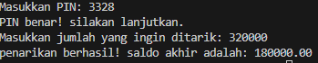

Kode di atas digunakan untuk mensimulasikan proses penarikan uang dari ATM, dengan beberapa operasi seperti validasi PIN dan pengecekan saldo. 

### 4. [Anda diberikan file CSV berisi data nilai ujian mahasiswa. Tugas Anda adalah menulis sebuah program yang: 1. Membaca file CSV dan menyimpan datanya ke dalam dictionary. 2. Menghitung rata-rata nilai tiap mahasiswa. 3. Menampilkan mahasiswa dengan nilai tertinggi dan terendah.]

```python
import pandas as pd
import csv

#  membaca file CSV dan simpan di dict
def csvdict (namafile):
    data = {}
    with open (namafile, mode='r') as file:
        bacacsv = csv.reader(file)
        next(bacacsv)  # membaca header
        for baris in bacacsv:
            nama = baris[0]  
            nilai = list(map(float, baris[1:]))  # jadikan float
            data[nama] = nilai  
    return data

#  menghitung rata2 semua mhs
def hitungrata2(data):
    rata2 = {}
    for nama, nilai in data.items():
        if nilai:  # cek daftar nilai 
           rata2[nama] = sum(nilai) / len(nilai)  
    return rata2

# menemukan nilai rata2 tertinggi dan terendah
def caritertinggiterendah(rata2):
    tertinggi = max(rata2, key=rata2.get)
    terendah = min(rata2, key=rata2.get)
    return tertinggi, terendah

# main
def main():
    namafile = 'C:/Users/Admin/Documents/IPSD ASSIGNMENT/modul 1/nilaisiswa.csv'  # Ubah sesuai dengan jalur file di sistem Anda
    data = csvdict (namafile)
    
    rata2 = hitungrata2(data)
    print("Rata-rata nilai tiap mahasiswa:")
    for nama, avg in rata2.items():
        print(f"{nama}: {avg:.2f}")
    
    tertinggi, terendah = caritertinggiterendah (rata2)
    print(f"\nMahasiswa dengan nilai rata-rata tertinggi: {tertinggi} ({rata2[tertinggi]:.2f})")
    print(f"Mahasiswa dengan nilai rata-rata terendah: {terendah} ({rata2[terendah]:.2f})")

if __name__ == "__main__":
    main()

```
#### Output:
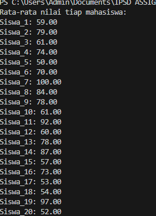 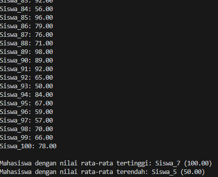

Kode di atas digunakan untuk membaca csv dan menyimpannya di dictionary. lalu menghitung rata2 tiap mahasiswanya dan dicari rata2 tertinggi dan teredah.

### 5. [**: Buatlah permainan sederhana menggunakan Python, di mana komputer akan memilih sebuah angka secara acak antara 1 hingga 100, dan pengguna harus menebak angka tersebut. Setiap tebakan yang salah akan memberikan petunjuk apakah angka yang ditebak lebih besar atau lebih kecil dari angka sebenarnya. Batasi jumlah percobaan menjadi 5 kali. Setelah permainan selesai, tampilkan apakah pemain menang atau kalah.]

```python

import random
def tebakangka():
    angkarahasia = random.randint(1, 100) 
    kesempatan = 5  

    print("Selamat datang di permainan tebak angka!")
    print("Pilih angka antara 1 hingga 100.")
    print(f"Kamu punya {kesempatan} kesempatan untuk menebaknya.\n")

    for percobaan in range(1, kesempatan + 1):
        try:
            tebakan = int(input(f"Tebakan {percobaan}: Masukkan angka: "))

            if tebakan < 1 or tebakan > 100:
                print("Angka harus antara 1 dan 100! Coba lagi.\n")
                continue

            if tebakan == angkarahasia:
                print(f"Selamat! Kamu menebak angka yang benar ({angkarahasia}) dalam {percobaan} percobaan.")
                break
            elif tebakan < angkarahasia:
                print("Tebakanmu terlalu kecil.")
            else:
                print("Tebakanmu terlalu besar.")
            
            if percobaan == kesempatan:
                print(f"kamu kehabisan kesempatan! angka yang benar adalah {angkarahasia}.")

        except ValueError:
            print("Harap masukkan angka yang valid!")

if __name__ == "__main__":
    tebakangka()

```
#### Output:
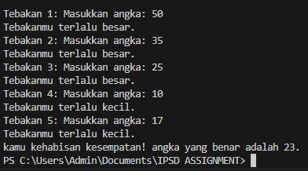

Kode di atas digunakan untuk permainan tebak angka dengan kesempatan mencoba 5x.

### 6. [Buat fungsi rekursif yang menerima input bilangan bulat `n` dan menghasilkan urutan bilangan seperti berikut ini Input: n = 4 Output: 1, 1, 2, 6, 24  Fungsi ini harus menggunakan konsep rekursi untuk menghitung faktorial setiap angka hingga `n`.]

```python

def faktorial(n):
    if n == 0 or n == 1:
        return 1
    else:
        return n * faktorial(n - 1)

def urutanfaktorial(n):
    hasil = []
    for i in range(n + 1):
        hasil.append(faktorial(i))
    return hasil

# main
n = int(input("Masukkan bilangan bulat n: "))
output = urutanfaktorial(n)
print("Output:", ', '.join(map(str, output)))

```
#### Output:
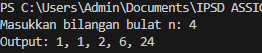

Kode di atas digunakan untuk menghtung faktorial dengan konsep rekursif.

### 7. [Buatlah program untuk memecahkan masalah "minimum coin change". Diberikan jumlah uang dan daftar nilai koin yang tersedia (misalnya, 1, 5, 10, 25), tentukan kombinasi minimum koin yang diperlukan untuk mencapai jumlah uang tersebut. Namun, program Anda harus bisa menangani koin-koin yang nilai dan jumlahnya ditentukan pengguna.]

```python
def mincoin(banyak, koin, jumlah):
    # membuat tabel
    dp = [[float('inf')] * (banyak + 1) for _ in range(len(koin) + 1)]
    
    # jika jumlah uang 0, tidak diperlukan koin
    for i in range(len(koin) + 1):
        dp[i][0] = 0
    
    # mengisi tabel
    for i in range(1, len(koin) + 1):
        nilaikoin = koin[i - 1]
        jumlahkoin = jumlah[i - 1]
        
        for j in range(1, banyak + 1):
            # jika tidak pakai koin ke-i
            dp[i][j] = dp[i - 1][j]
            
            # coba pakai koin ke-i sampe batas ketersediaannya
            for k in range(1, jumlahkoin + 1):
                if k * nilaikoin <= j:
                    dp[i][j] = min(dp[i][j], dp[i - 1][j - k * nilaikoin] + k)

    # jika tidak ada solusi, kembalikan -1
    return dp[-1][-1] if dp[-1][-1] != float('inf') else -1


# input 
banyak = int(input("Masukkan jumlah uang: "))
koin = list(map(int, input("Masukkan daftar nilai koin (pisahkan dengan spasi): ").split()))
jumlah = list(map(int, input("Masukkan daftar jumlah koin (sesuai urutan nilai koin, pisahkan dengan spasi): ").split()))

# run fungsi
result = mincoin(banyak, koin, jumlah)

if result == -1:
    print("Tidak dapat mencapai jumlah uang dengan kombinasi koin yang diberikan.")
else:
    print(f"Jumlah minimum koin yang diperlukan: {result}")

```
#### Output:
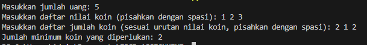

Kode di atas digunakan untuk menyelesaikan masalah minimum koin dengan batas ketersediaan. bertujuan untuk mencari jumlah minimum koin yang dibutuhkan untuk mencapai sejumlah uang tertentu.

### 8. [Buat sebuah program yang menerima string dari pengguna dan mengonversi string tersebut menjadi sebuah list berisi kata-kata terbalik. Misalnya: Input: "Saya suka Python" Output: ["ayaS", "akus", "nohtyP"]]

```python
def katadibalik(kalimat):
    # memisahkan string 
    kata2 = kalimat.split()
    # membalikan setiap kata 
    katayangdibalik = [kata[::-1] for kata in kata2]
    return katayangdibalik

# input 
kalimat = input("Masukkan sebuah kalimat: ")
result = katadibalik(kalimat)
print(result)

```
#### Output:
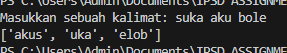

Kode di atas digunakan untuk membalikan semua kata dalam suatu kalimat.

### 9. [Buat class bernama `Buku` yang memiliki atribut `judul`, `penulis`, dan `tahun_terbit`. Buat method dalam class untuk menampilkan informasi buku, serta method untuk menghitung usia buku berdasarkan tahun saat ini. Buatlah 3 objek dari class `Buku` dan tampilkan informasi serta usia masing-masing buku.]

```python

from datetime import datetime
class buku:
    def __init__(buku, judul, penulis, tahun_terbit):
        buku.judul = judul
        buku.penulis = penulis
        buku.tahun_terbit = tahun_terbit

    # informasi buku
    def tampilkan_informasi(buku):
        print(f"Judul: {buku.judul}")
        print(f"Penulis: {buku.penulis}")
        print(f"Tahun Terbit: {buku.tahun_terbit}")

    # usia buku
    def hitung_usia(buku):
        tahun_sekarang = datetime.now().year
        usia = tahun_sekarang - buku.tahun_terbit
        return usia


# objek buku
buku1 = buku("Pride And Prejudice", "Jane Austin", 1813)
buku2 = buku("Hamlet", "William Shakespare", 1623)
buku3 = buku("Anna Karenina", "Leo Tolstoy", 1873)

# menampilkan informasi dan usia buku
print("Informasi Buku 1:")
buku1.tampilkan_informasi()
print(f"Usia Buku: {buku1.hitung_usia()} tahun\n")

print("Informasi Buku 2:")
buku2.tampilkan_informasi()
print(f"Usia Buku: {buku2.hitung_usia()} tahun\n")

print("Informasi Buku 3:")
buku3.tampilkan_informasi()
print(f"Usia Buku: {buku3.hitung_usia()} tahun")

```
#### Output:
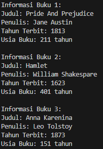

Kode di atas digunakan untuk membuat kelas yang berisi informasi buku dan memliki fungsi menghitung usia buku.

### 10. [Buatlah program yang mengimplementasikan algoritma pencarian biner, namun dengan modifikasi: algoritma harus bisa mencari nilai di list yang hanya berisi angka genap, dan jika nilai yang dicari adalah angka ganjil, program harus menampilkan pesan bahwa nilai tersebut tidak bisa ditemukan.]

```python
def binarysearch(arr, target):
    # cek jika yg diinput adalah ganjil
    if target % 2 != 0:
        print(f"Nilai {target} adalah angka ganjil dan tidak bisa ditemukan.")
        return -1
    
    # batas bawah dan atas
    low = 0
    high = len(arr) - 1
    
    while low <= high:
        mid = (low + high) // 2
        # jika yang dicari adalah nilai tengah, kembalikan indeksnya
        if arr[mid] == target:
            return mid
        # jika yang dicari lebih kecil dari nilai tengah, fokus pada bagian kiri
        elif arr[mid] > target:
            high = mid - 1
        # jika yg dicari lebih besar, fokus pada bagian kanan
        else:
            low = mid + 1
    
    # jika tidak ditemukan, kembalikan -1
    return -1

# list angka genap 
arr = [2, 4, 6, 8, 10, 12, 14, 16, 18, 20]

# input user
target = int(input("Masukkan angka yang ingin dicari: "))

# memanggil fungsi binary
result = binarysearch(arr, target)

# hasil
if result != -1:
    print(f"Nilai {target} ditemukan pada indeks {result}.")
else:
    if target % 2 == 0:
        print(f"Nilai {target} tidak ditemukan di dalam list.")

```
#### Output:
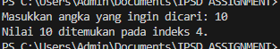

Kode di atas digunakan untuk melakukan pencarian biner di sebuah list yang berisi angka genap. kode ini memiliki modifikasi khusus yang hanya mengizinkan pencarian untuk angka genap. 

## Kesimpulan
program-program diatas memberikan pemahaman lebih mendalam tentang pemrograman dasar yang melibatkan logika, matematika, dan pengoptimalan dalam konteks Python.[1].

## Referensi
[1] Maulana Fahrudin,Tresna.Algoritma dan Pemrograman Dasar Dalam Bahasa Python. Gresik: Thalibul Ilmi Publishing & Education; 2023.